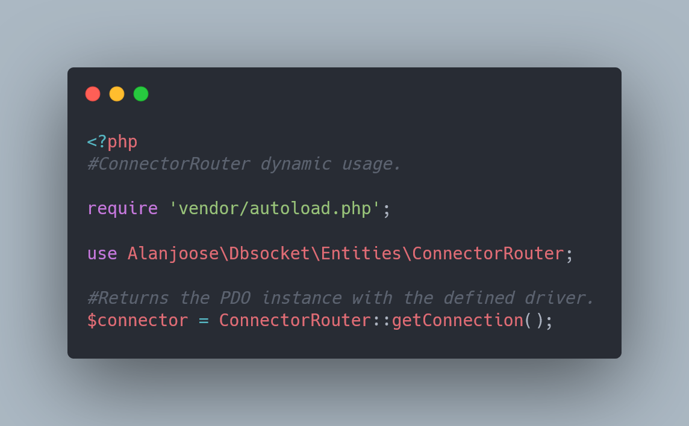

# DBSocket

## What is it?

DBSocket is a package that provides environment-based database connection management for PHP applications.

## Features

- **Dynamic Connector Routing:** Allows for dynamic selection of database connectors.
- **Single Connector Architecture:** Simplifies the choice of connector.
- **Database Access:** Facilitates database access.
- **Simple & Flexible Configuration:** Easy to configure and adapt.
- **Simple Testing Structure:** Integrated testing framework.

## Installation

To install the **DBSocket** package, use the following command: <code>composer require alanjoose/dbsocket</code>.
Then, run the <code>composer install</code>. Then configure your environment with the following variables:

<ul>
    <li><code>DB_DRIVER</code> (<b>String, Required</b>, if you use <b>ConnectorRouter</b>)</li>
    <li><code>DB_HOST</code> (<b>String, Required</b>, if you use ipv4 access. If you use unix_socket define it here)</li>
    <li><code>DB_PORT</code> (<b>Int, Prohibited</b>, if you use unix_socket)</li>
    <li><code>DB_NAME</code> (<b>String, Required</b>)</li>
    <li><code>DB_USERNAME</code> (<b>String, Nullable</b>)</li>
    <li><code>DB_PASSWORD</code> (<b>String, Nullable</b>)</li>
    <li><code>DB_CHARSET</code> (<b>String, Nullable</b>, <code>utf8</code> by default)</li>
    <b>Exclusive for MySQL, PGSQL</b>
    <li><code>DB_USE_UNIX_SOCKET</code> (<b>String, Nullable</b>)</li>
</ul>

### Basic usage example

