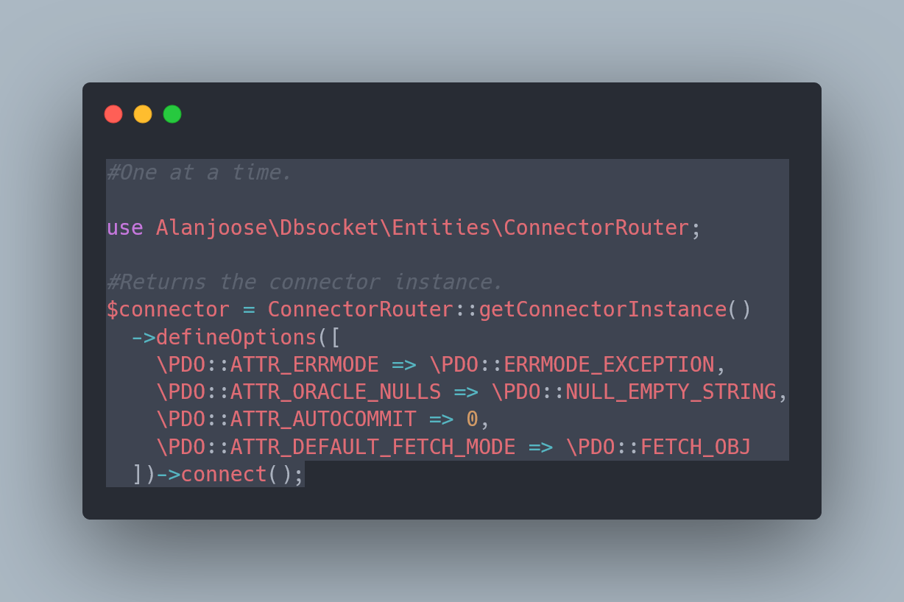

# DBSocket

## Usage guide

### Configuration

    To use the package you must run the <code>composer install</code> command. And then configure
    your server environment, since the connector uses the settings in this way.
    The variables used are the following:

<ul>
    <li><code>DB_DRIVER</code></li>
    <li><code>DB_HOST</code></li>
    <li><code>DB_PORT</code></li>
    <li><code>DB_NAME</code></li>
    <li><code>DB_USERNAME</code></li>
    <li><code>DB_PASSWORD</code></li>
    <li><code>DB_CHARSET</code></li>
    <li><code>DB_USE_UNIX_SOCKET</code></li>
</ul>

    These variables can be defined by the super global <code>$_ENV</code>. 
    <b>Note: There are DBMS models that allow some of them to be omitted.</b>

#### TIP

    You can use the <a href="https://packagist.org/packages/vlucas/phpdotenv" target="_blank">vlucas/phpdotenv</a>
    package to define and manage your environment variables. I particularly recommend it.

### Using DBSocket

    The package has an entity called <code>ConnectorRouter</code> that creates an instance of the connector based on the driver
    defined in the environment variables and using predefined options for each driver. It can be used in the following way:

    If you prefer to manually configure the connector, you can do it as follows:

    Or set the options all at once:

